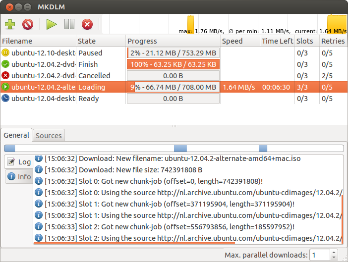
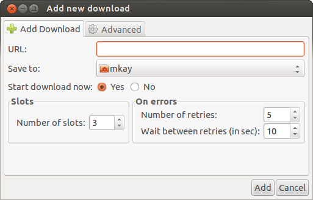
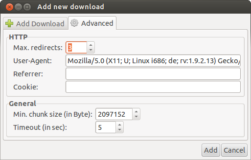
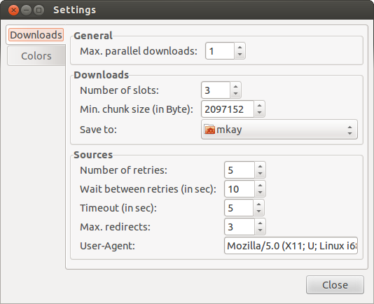
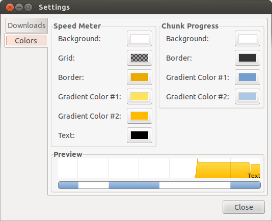

MKDLM - Python based download manager
=====================================

`mkdlm` is a python based download manager.
I started the development in 2011 because I didn't like the download managers which were available for linux at this time. :-)

> Note: I am currently not working on `mkdlm` because of lack of time. Feel free to pick up the code and enhance/extend mkdlm :-)

Features:
* Supported Protocols: FTP/HTTP
* Pause/Resume/Cancel downloads
* Multiple parallel downloads
* Chunked loading: Use multiple connections per download
* Download one file from different servers
* Auto-Retry on errors

Here is a screenshot of the main window:


See more screenshots at the end of the page.

Running on Ubuntu 12.04
-----------------------
Install the required packages:
```
$ sudo apt-get install git python-yaml
```
Download and start `mkdlm`:
```
$ git clone https://github.com/da-mkay/mkdlm.git
$ cd mkdlm/src
$ python mkdlm.py
```

Some ideas for future development:
----------------------------------
* I18n
* Accept url/cookies/referer from commandline-arguments to start download from cmd
    (to pass downloads from a browser to `mkdlm`, e.g. using FlashGot)
* Speed limit (global and per file)
* Move downloads up/down in the list
* Shutdown the PC after downloads were finished (plugins?!)
* Increase/decrease number of slots while download is running
* Other protocols: HTTPS, FTP(E)S, ...

More screenshots:
-----------------




